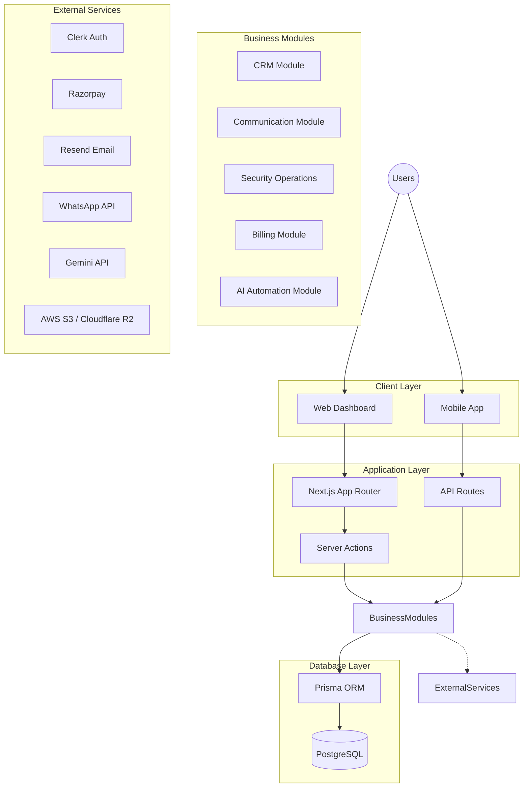

# System Architecture

## 1. System Architecture

The AI Security CRM SaaS platform is built using a Modular Monolithic Architecture, designed to scale seamlessly while minimizing operational complexity during the early stages of production. 

### Layer Explanation

*   **Client Layer**: Interfaces through which users interact with the platform.
*   **Application Layer**: Handles incoming HTTP requests. Utilizes Next.js Server Actions for tight frontend integration and API routes for mobile/external consumption.
*   **Business Modules**: Domain-specific logic encapsulating the distinct functionalities of the SaaS platform.
*   **Database Layer**: Persistent storage using PostgreSQL, interfaced securely via Prisma ORM.
*   **External Services**: Third-party APIs integrated for specialized capabilities (authentication, payments, AI, etc.).

---

## 2. Application Architecture

The platform follows a **Modular Monolithic Architecture**. This approach avoids the networking overhead and deployment complexity of microservices for the initial production launch while enforcing strict logical boundaries to permit future service separation.

### Frontend Structure

*   **Pages**: Built with Next.js 15 App Router (`app/` directory). Employs React Server Components (RSC) to reduce client bundle size and improve SEO/performance.
*   **Components**: Isolated, reusable UI blocks. Complex UI relies on shadcn/ui and Tailwind CSS.
*   **UI System**: Radix primitives via shadcn/ui for accessible, unstyled baseline components, styled via Tailwind CSS. Animations powered by Framer Motion.
*   **State Management Approach**: 
    *   **Server State**: Handled natively by Next.js Server Components, Server Actions, and React Suspense boundaries.
    *   **Client State**: React Context and standard hooks (e.g., `useState`, `useReducer`) for localized interactive state.

### Backend Structure

*   **Routes**: Next.js Server Actions handle form submissions and data mutations directly from the web dashboard. Standard Next.js API Routes (`app/api/`) serve external clients and the future mobile app.
*   **Services**: Core business logic is strictly encapsulated in a `services/` directory, broken down by domain (e.g., `crmService`, `billingService`). Routes only invoke these services.
*   **Database Layer**: Prisma ORM acts as the single source of truth for database interactions, ensuring type safety from schema to client.
*   **Validation Layer**: Zod is used for end-to-end schema validation. Every API route and Server Action validates incoming payloads before hitting the service layer.
*   **Authentication Middleware**: Next.js Middleware intercepts requests to verify Clerk JWTs, enforce route protection, and inject tenant context.

---

## 3. Database Architecture

*   **Database**: PostgreSQL provides ACID compliance, JSONB support for unstructured module data, and robust relational integrity.
*   **Prisma ORM Role**: Enforces a strongly typed schema, automates migrations, and provides an intuitive query builder.
*   **Migration Strategy**: Prisma Migrate will handle deterministic schema evolution, integrated directly into the CI/CD deployment pipeline.

### Multi-Tenant Database Approach (Hardened)

The platform utilizes a **Logical Isolation (Row-Level Multi-Tenancy)** strategy reinforced by database-level security. 
*   All tenants share the same database and schemas.
*   Every table containing tenant-specific data requires a `tenantId` (foreign key to the `Tenant` or `Organization` model).

**The Final Protection Model:**
*   **Application Layer**: Tenant validation, Authorization checks, and Prisma tenant middleware/extensions automatically inject the `tenantId`.
*   **Database Layer**: **PostgreSQL Row-Level Security (RLS) policies** are applied to all tenant tables. Before executing a query, the application sets a session variable (e.g., `app.current_tenant`). The RLS policy restricts access at the database engine level so that `tenantId = current_setting('app.current_tenant')`. 
*   **Purpose**: Even if application logic fails or a developer writes a raw, unbounded SQL query, database policies physically prevent cross-tenant data access.

---

## 4. Security Architecture

*   **Authentication Flow**: Handled by Clerk. Users authenticate via standard OAuth or email/password. Clerk issues standard JWTs.
*   **Authorization Flow**: JWTs are validated at the edge using Next.js Middleware. The middleware extracts the user ID and active `tenantId`.
*   **Role-Based Permissions (RBAC)**: Fine-grained permissions based on `Role + Permission + Resource + Action` are evaluated by the service layer.
*   **Tenant Data Isolation**: Enforced consistently at the data access layer (Prisma Extensions) AND the database level (PostgreSQL RLS).
*   **API Protection**: Global edge rate limits are insufficient. We implement **Tenant-level rate limiting** (using Redis / Upstash) to prevent a single noisy tenant from consuming the platform's resources and causing a Denial of Service for others.
*   **File Security**: Uploads to S3/R2 are strictly private, encrypted at rest, and accessed exclusively via short-lived signed URLs.
*   **Audit Logging**: Critical mutations trigger audit log entries stored with tenant context.
*   **Secret Management**: Environment variables managed via Vercel for production. Tenant-specific secrets (integrations) are securely encrypted in the database.

---

## 5. Module Dependency Map

1.  **Foundation** (Next.js config, UI system setup, DB connection)
2.  **Authentication** (Clerk integration)
3.  **Multi Tenant System** (Tenant data isolation, RLS, RBAC)
4.  **Communication System** (Sockets, Resend, WhatsApp API - required for CRM alerts)
5.  **CRM** (Core business logic, relies on Comms)
6.  **Billing** (Razorpay, tied to Tenants)
7.  **Security Operations** (Incident management, relies on CRM and Comms)
8.  **AI Features** (Gemini integration for analyzing existing CRM/Security data)
9.  **Advanced Computer Vision** (CCTV integrations)
10. **Mobile Applications** (Consuming mature API routes)

---

## 6. Future Scalability Plan

The system is designed to scale gracefully:

*   **10 Companies**: Standard Vercel deployment and a managed PostgreSQL instance.
*   **100 Companies**: Introduce Redis/Upstash for caching and tenant-level rate limiting. Offload heavy operations to background jobs.
*   **1000+ Companies**: 
    *   **Database Scaling**: Read replicas for PostgreSQL. 
    *   **CCTV Health Data**: To handle 1000+ companies with potentially tens of thousands of cameras pinging every minute, standard relational storage will fail. We will utilize a Time-Series extension (like **TimescaleDB**) or a dedicated time-series storage strategy for `CameraHealth` to ensure long-term stability and fast aggregation.
    *   **Service Separation**: The modular monolith can be split (e.g., extracting AI or CCTV into Python microservices).

---

## 7. Technology Justification

*   **Next.js 15 (TypeScript)**: Full-stack capabilities, excellent developer experience, and RSCs.
*   **Tailwind CSS + shadcn/ui**: Rapid UI development without fighting framework overrides.
*   **PostgreSQL + Prisma**: Proven relational stability. Prisma offers the best DX for TypeScript.
*   **Clerk**: Out-of-the-box multi-tenant support (Organizations), secure, fast integration.
*   **AWS S3 / Cloudflare R2**: Industry standard for blob storage.
*   **Razorpay**: Robust API for global subscription management.
*   **Gemini API**: State-of-the-art multimodal AI for automated incident analysis.
