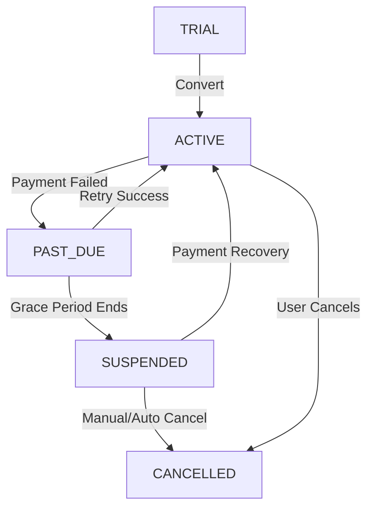

# Billing Implementation Plan

## 1. Billing Module Scope
The AI Security CRM SaaS platform requires a comprehensive Billing system capable of managing:
- **Tenant subscriptions**: Handling multi-tenant subscription states natively.
- **Plans**: Differentiating tier access (e.g., Starter, Pro, Enterprise) by price, billing cycle, and feature limits.
- **Usage tracking**: Metering consumption across core services (users, storage, AI queries, communications) for overage billing or limits.
- **Invoices**: Generating, storing, and tracking the payment state of invoices.
- **Payments**: Handling raw transactions mapped back to Invoices.
- **Payment Providers**: Abstracted connections to gateways (Razorpay, Stripe, PayPal).
- **Billing History**: Preserving complete logs for auditing and compliance.

## 2. Database Design Proposal

### Plan
Global model defining subscription tiers.
- `id`: String @id
- `name`: String
- `price`: Decimal
- `billingCycle`: Enum (MONTHLY, YEARLY)
- `limits`: Json (maxUsers, maxCameras, maxStorage, etc.)
- `features`: Json (enabled toggles)

### Subscription
Tenant-owned model representing the active subscription.
- `id`: String @id
- `tenantId`: String
- `planId`: String
- `status`: Enum (TRIAL, ACTIVE, PAST_DUE, SUSPENDED, CANCELLED)
- `startDate`: DateTime
- `endDate`: DateTime
- `renewalDate`: DateTime

### Invoice
Tenant-owned immutable billing record.
- `id`: String @id
- `tenantId`: String
- `subscriptionId`: String
- `amount`: Decimal
- `status`: Enum (DRAFT, OPEN, PAID, VOID, UNCOLLECTIBLE)
- `invoiceNumber`: String @unique

### Payment
Tenant-owned ledger of individual transactions.
- `id`: String @id
- `tenantId`: String
- `invoiceId`: String
- `provider`: Enum (RAZORPAY, STRIPE, PAYPAL)
- `transactionId`: String @unique
- `status`: Enum (PENDING, SUCCESS, FAILED, REFUNDED)

### UsageRecord
Tenant-owned tracking table for metered billing constraints.
- `id`: String @id
- `tenantId`: String
- `users`: Int
- `cameras`: Int
- `storage`: Int
- `aiRequests`: Int
- `communicationUsage`: Int
- `periodStart`: DateTime
- `periodEnd`: DateTime

## 3. Payment Provider Abstraction

Just as in the Communication module, payment gateways will be dependency-injected via a `src/lib/providers/payment/` layer.

**Interface: `PaymentProvider`**
```typescript
export interface PaymentProvider {
  createCustomer(tenantData): Promise<CustomerResult>;
  createSubscription(customerId, planId): Promise<SubscriptionResult>;
  createPayment(invoiceId, amount): Promise<PaymentResult>;
  refundPayment(transactionId): Promise<RefundResult>;
  verifyWebhook(signature, payload): Promise<boolean>;
}
```

**Supported Implementations**:
- `RazorpayProvider`
- `StripeProvider`
- `PayPalProvider`

## 4. Security

- **Tenant Billing Isolation**: All models except `Plan` will contain `tenantId` and strictly enforce ownership through the Prisma Tenant middleware.
- **Encrypted Metadata**: Provider-specific secrets (e.g., Stripe Customer IDs, Razorpay Tokens) will be hashed or encrypted at rest where applicable, and never exposed to the client.
- **Webhook Signature Verification**: `PaymentProvider.verifyWebhook` will mathematically validate incoming payloads from Stripe/Razorpay to prevent fraudulent invoice status manipulation.
- **Invoice Immutability**: Once an `Invoice` status transitions to `PAID` or `OPEN`, financial records must not be deleted or structurally altered (append-only ledger concept).
- **Audit Logging**: Any subscription change or payment transaction will inject an `AuditLog` entry securely.

## 5. Subscription Lifecycle



## 6. RBAC Integration

To control financial visibility and actionability, the `Resource` enum will require `BILLING`, `INVOICE`, and `PAYMENT`.

**Permissions**:
- `BILLING:READ` (View current plan and limits)
- `BILLING:MANAGE` (Upgrade/downgrade subscription, modify payment methods)
- `INVOICE:READ` (View and download past invoices)
- `PAYMENT:REFUND` (System Admin / Owner tier operation to process refunds)

## 7. Future Implementation Phases

- **Phase 5.1 Billing Schema**: Prisma model implementation and migration.
- **Phase 5.2 Payment Provider Layer**: Constructing `PaymentProvider` interface and Razorpay/Stripe mocks.
- **Phase 5.3 Billing Services**: Building backend lifecycle operations and subscription syncing.
- **Phase 5.4 Billing API**: Building Zod schemas and Next.js Server Actions.
- **Phase 5.5 Billing UI**: Constructing the frontend `/billing` dashboard and checkout flows.
