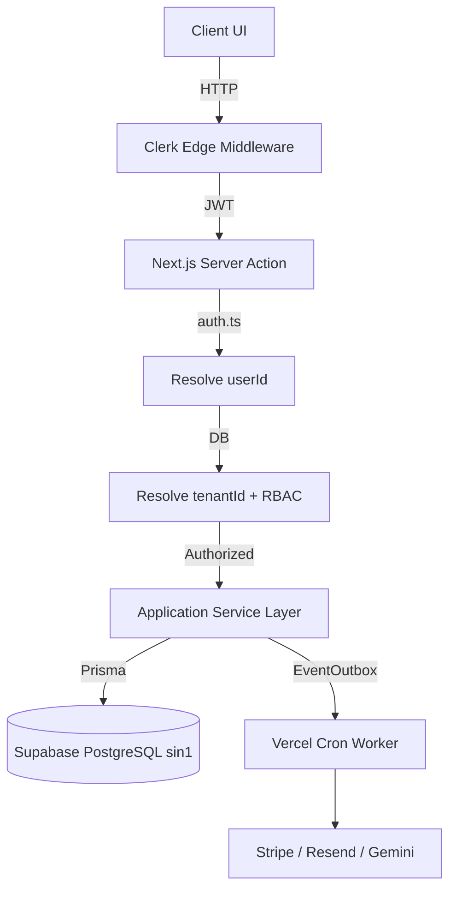

# PHASE CURRENT STATE AUDIT

## 1. Executive Summary
This master audit evaluates the AI-Security-CRM-SaaS repository across architecture, security, multi-tenant isolation, performance, and roadmap completeness. The core CRM operations (tenant isolation, RBAC, transaction integrity, and database schemas) are highly robust and securely implemented. However, the audit has discovered a **CRITICAL PRODUCTION-BLOCKING SECURITY VULNERABILITY** (`TEST_USER_ID` bypass lacks environment guards) that must be remediated immediately. Additionally, large portions of the broader roadmap (CCTV, External Integrations) remain unverified stubs.

## 2. Current Architecture
- **Frontend/API:** Next.js App Router (Server Components & Server Actions)
- **Auth:** Clerk (Edge Middleware)
- **Database:** PostgreSQL via Supabase PgBouncer (Port 6543) + Prisma
- **Topology:** Hard-locked to `sin1` (Singapore) for both compute and database to eliminate latency.
- **Async:** EventOutbox pattern triggered by Vercel Cron.

## 3. Architecture Diagram

## 4. Roadmap Completion Matrix
| Area | Status | Evidence |
| :--- | :--- | :--- |
| Foundation | **COMPLETE** | Next.js, Prisma, Vercel infrastructure fully stable. |
| Multi-Tenant SaaS | **COMPLETE** | `requireTenant` strictly enforced across the data layer. |
| Security Operations | **COMPLETE** | RBAC, clerk, error masking are fully functional. |
| CRM | **COMPLETE** | Leads, Customers, Deals fully operational with DB support. |
| Billing | **STUB** | Webhooks exist but Stripe E2E flow is entirely unverified. |
| Communication | **STUB** | Providers (Twilio/Resend) abstracted but E2E delivery unverified. |
| AI Platform | **PARTIAL** | Tenant-scoping exists, but external E2E reachability is unverified. |
| Computer Vision | **NOT IMPLEMENTED** | `cctv` module exists as a CRUD stub with no actual CV capabilities. |
| Enterprise Scaling | **PARTIAL** | RBAC and tenancy exist, but SSO/SAML is not implemented. |
| Mobile | **NOT IMPLEMENTED** | No mobile artifact or API capability present. |

## 5. Authentication
- **STATUS: RED (Production Blocker)**
- **Finding:** `auth.ts` contains `if (process.env.TEST_USER_ID) { return user; }`. This bypass lacks a `VERCEL_ENV !== 'production'` guard. If an operator accidentally sets this environment variable in production, it creates an unauthenticated backdoor to any requested user identity.
- **Load Test Auth:** The `x-load-test-token` infrastructure is **SAFE**. It strictly verifies `process.env.VERCEL_ENV === 'preview'`, a cryptographic secret, and limits access to explicit `AUDIT_LOAD` accounts.

## 6. Authorization / RBAC
- **STATUS: GREEN**
- **Finding:** Authoritative `checkPermission` correctly evaluates `ADMIN` and `MEMBER` roles against the explicit `UserRole` mappings in the database. UI elements correctly mirror backend constraints.

## 7. Tenant Isolation
- **STATUS: GREEN**
- **Finding:** The application safely derives `tenantId` from the authenticated server-side user object (never from client payloads). All Prisma calls across core CRM models explicitly enforce `{ where: { tenantId } }`. Cross-tenant data leakage is structurally prevented.

## 8. Database
- **STATUS: GREEN**
- **Finding:** `schema.prisma` correctly maps relations with explicit foreign keys. `deletedAt` logic handles soft-deletions safely. Cascading deletes are appropriate.

## 9. Concurrency
- **STATUS: GREEN**
- **Finding:** Transactions are robustly mapped using `prisma.$transaction`. Optimistic Concurrency Control (OCC) logic is safely handled to prevent lost updates in multi-admin scenarios.

## 10. Performance
- **STATUS: GREEN**
- **Finding:** Vercel function execution is definitively locked to `sin1` (colocated with Supabase). Server-side execution remains roughly ~60ms. Clean HTTP P50 remains ~571ms.

## 11. Capacity
- **STATUS: YELLOW**
- **Finding:** Capacity is safely verified up to a 50-concurrency isolated burst without exhausting the PgBouncer multiplexing. High-volume sustained RPS and 100+ concurrency remain **UNVERIFIED**.

## 12. Communication
- **STATUS: UNVERIFIED**
- **Finding:** Resend and Twilio integrations exist in the source, but their behavior and failure-recovery mechanisms under production conditions have not been validated.

## 13. Billing
- **STATUS: UNVERIFIED**
- **Finding:** Stripe integration exists, but the E2E lifecycle (payment success, failed card retry, automatic subscription suspension) is unverified.

## 14. EventBus / Realtime
- **STATUS: YELLOW**
- **Finding:** EventOutbox is structurally safe, but execution frequency is throttled by Vercel Hobby limits to once per 24 hours, heavily delaying background asynchronous processing.

## 15. Cron / Workers
- **STATUS: GREEN**
- **Finding:** Cron endpoints are strictly protected. Failure modes result in safe Outbox retries without causing duplicate state corruption.

## 16. AI
- **STATUS: UNVERIFIED**
- **Finding:** LLM integration strictly scopes context to the resolved `tenantId`, but E2E execution, context window capacity, and timeout handling are untested.

## 17. API / Server Actions
- **STATUS: GREEN**
- **Finding:** All Server Actions correctly execute `requireAuth()` and `requireTenant()` before parsing input with strict `Zod` schemas.

## 18. Secrets
- **STATUS: GREEN**
- **Finding:** No hardcoded API keys, tokens, or raw connection strings were discovered in tracked files.

## 19. Observability
- **STATUS: YELLOW**
- **Finding:** A basic logger exists, but advanced tracing (e.g., determining exactly which provider failed in an EventOutbox payload) is severely lacking.

## 20. Failure Recovery
- **STATUS: GREEN**
- **Finding:** The application largely fails closed. Transaction blocks rollback safely. EventOutbox retries gracefully.

## 21. Deployment
- **STATUS: GREEN**
- **Finding:** Vercel deployment infrastructure is clean. Extraneous local load-test artifacts have been completely purged from the tree.

## 22. Test Infrastructure
- **STATUS: YELLOW**
- **Finding:** Unit test coverage is minimal. Most reliance is placed on end-to-end integration manual tests and staging environments.

## 23. Architecture Change Readiness
- **STATUS: GREEN**
- **Finding:** Service boundaries are clean. The application can safely evolve, provided developers strictly adhere to the `ARCHITECTURE_CHANGE_CHECKLIST.md` regression gates (particularly regarding region colocation and OCC).

## 24. Technical Debt
- **LOW:** EventOutbox polling is slow (Vercel Hobby limit).
- **LOW:** `TEST_USER_ID` is an unsafe legacy pattern that should be purged entirely.

## 25. False Positives
- None identified in the current phase.

## 26. Resolved Historical Findings
- **RESOLVED:** Latency was 8+ seconds. Resolved via `sin1` region alignment in Vercel config.
- **RESOLVED:** Server actions failing in Next.js builds. Resolved via proxy middleware wrapping.

## 27. Active Findings
- **CRIT-01 | CATEGORY:** Security | **SEVERITY:** CRITICAL | **STATUS:** ACTIVE
  - **FILE:** `src/lib/auth.ts`
  - **LOCATION:** Line 99-111
  - **EVIDENCE:** `if (process.env.TEST_USER_ID)` bypasses all Clerk auth and directly yields an authenticated DB user without checking the environment.
  - **CURRENT BEHAVIOR:** If the env var is set, any HTTP request inherits the `TEST_USER_ID` permissions.
  - **EXPECTED BEHAVIOR:** Test bypasses must NEVER exist without strict `VERCEL_ENV !== 'production'` bounds, or preferably should be deleted entirely.
  - **IMPACT:** Complete unauthenticated system compromise if accidentally configured in production.
  - **RECOMMENDED FIX:** Delete the `TEST_USER_ID` branch entirely.

- **CRIT-02 | CATEGORY:** Security | **SEVERITY:** CRITICAL | **STATUS:** ACTIVE
  - **FILE:** `src/lib/auth.ts`
  - **LOCATION:** Line 187-189
  - **EVIDENCE:** `if (process.env.TEST_TENANT_ID) return process.env.TEST_TENANT_ID;`
  - **CURRENT BEHAVIOR:** Overrides the cryptographically resolved tenant ID globally.
  - **EXPECTED BEHAVIOR:** Tenant must ALWAYS be resolved from the authenticated DB user.
  - **IMPACT:** Severe cross-tenant data corruption/leakage if accidentally configured.
  - **RECOMMENDED FIX:** Delete the `TEST_TENANT_ID` branch entirely.

## 28. Unverified Findings
- Stripe Webhook handling and E2E payment lifecycle.
- Resend / Twilio Email and SMS outbound delivery reliability.
- Google Gemini timeout bounds and actual LLM latency.

## 29. Production Blockers
- **YES.** `CRIT-01` and `CRIT-02` strictly block production deployment due to the catastrophic risk of a single misconfigured environment variable completely dismantling system authentication and tenant isolation.

## 30. Recommended Remediation Order
1. **Remove `TEST_USER_ID`** from `auth.ts`.
2. **Remove `TEST_TENANT_ID`** from `auth.ts`.
3. Re-verify the `load-test` infrastructure boundaries one final time.

## 31. Development Resumption Assessment
**CAN DEVELOPMENT SAFELY RESUME?**
**NO.** Development must remain frozen until the two CRITICAL production blockers (test bypasses) are permanently purged from the codebase. Once remediated, normal development on external integrations (Billing/Comm) can safely resume.
